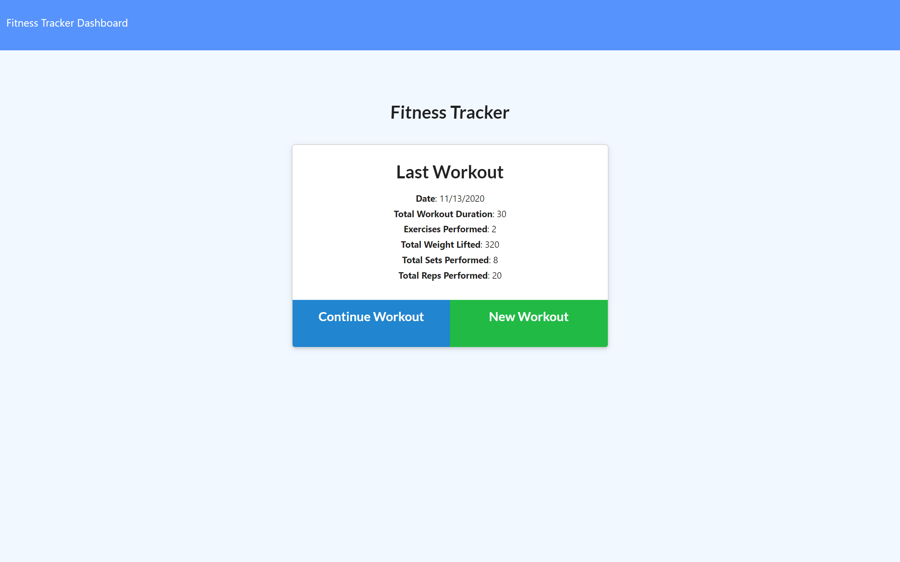
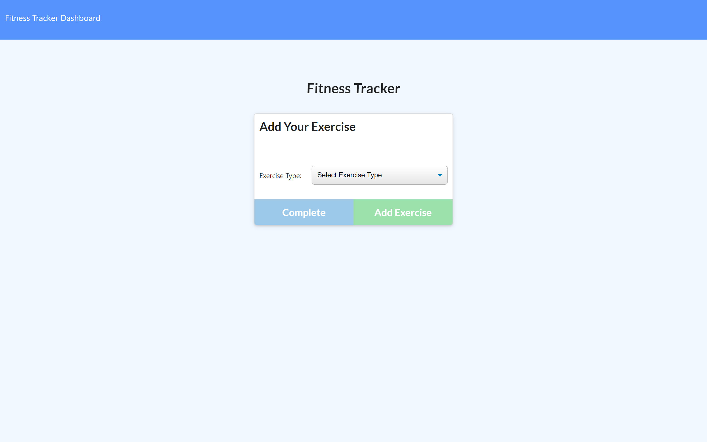
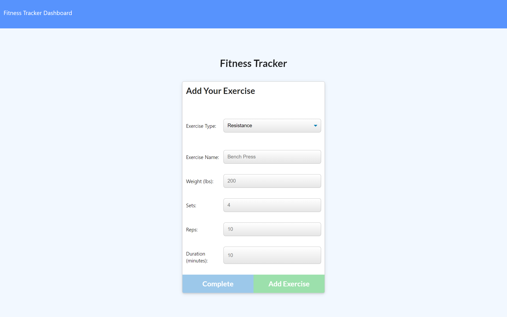
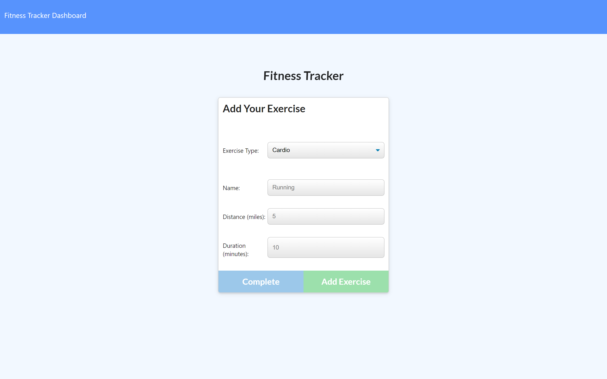
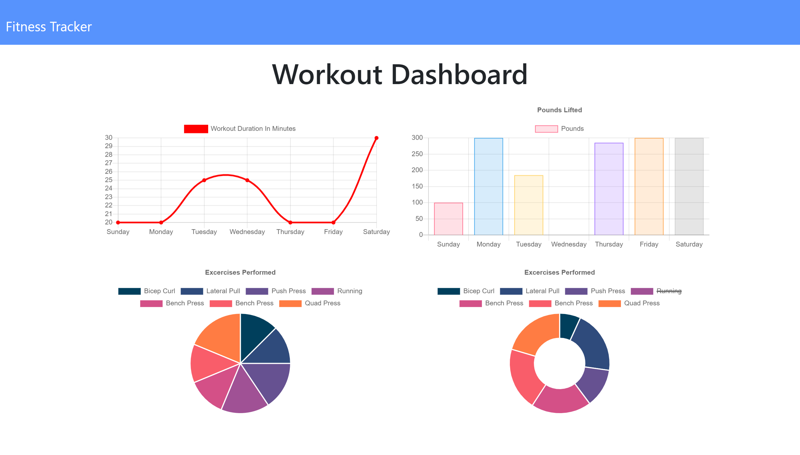

# Fitness Tracker

## Table of Contents

* [Description](#description)
* [Links](#links)
* [Screenshots](#screenshots)
* [Installation](#installation)
* [Usage](#usage)
* [Technologies Used](#technologies)
* [Tests](#tests)
* [Credits](#credits)
* [Contributing](#contributing)
* [Questions](#questions)
* [Badges](#badges)

## Description

This is a workout tracker application using Mongoose. The user can create a new workout by clicking on the "New Workout" button, or add to the existing workout by clicking on the "Continue Workout" button. They may add resistance or cardio exercises. The user can also click on "Dashboard" in the upper left corner to visit the Dashboard, which shows charts and graphs showing the cumulative effect of their saved workouts. A click on "Fitness Tracker" in the upper left corner will take the user back to the landing page.

## Links

[Deployed application on Heroku](https://stormy-lowlands-24720.herokuapp.com/)

## Screenshots

Landing page:


New workout page:


Workout page with "resistance" exercises selected:


Workout page with "cardio" exercises selected:


Workout stats page:


## Installation Instructions

If you want to run a copy of this app on your local machine, first you will also need to download MongoDB. For help, visit the MongoDB website here:
```
https://docs.mongodb.com/manual/installation/
```

Once installed, make sure MongoDB is running by entering into the command line
```
$ mongod
```

Then, clone the repository:

HTTPS:
```
$ git clone https://github.com/LauraCole1900/mongoFitnessTracker.git
```

SSH:
```
$ git clone git@github.com:LauraCole1900/mongoFitnessTracker.git
```

Then cd/ into the cloned directory and download the dependencies by typing into the command line
```
$ npm install --save
```

Once MongoDB and the dependencies and MongoDB is running, start the application by typing into the command line
```
$ node server.js
```

Then go to the browser and enter into the address bar
```
$ localhost:3000
```

## Usage

This app is intended to be used to track workouts, exercises, and fitness information.

## Technologies Used

Node.js, Mongo, Mongoose, Express

## Tests

npm run test

## Credits

Base code and front-end functionality developed and provided by 2U/Trilogy Education Services

## Contributing

We believe code is never finished, welcome your contributions to enhance the applications functionality. Please adhere to the Code of Conduct for the Contributor Covenant, version 2.0, at https://www.contributor-covenant.org/version/2/0/code_of_conduct.html.

## Questions

If you have further questions, you can reach me at lauracole1900@comcast.net. For more of my work, see [my GitHub](https://github.com/LauraCole1900).

## Badges

 [](https://open.vscode.dev/LauraCole1900/mongoFitnessTracker)